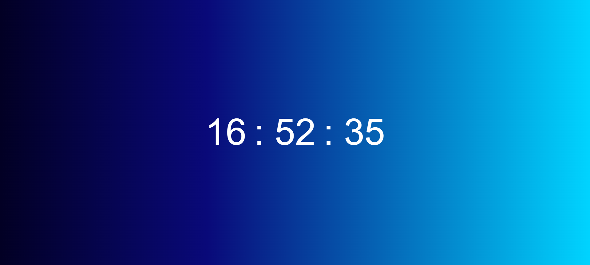

# 🕒 Relógio Digital

Um projeto simples de **Relógio Digital** feito com **HTML, CSS e JavaScript**, que exibe as horas, minutos e segundos em tempo real.

---

## 📸 Pré-visualização

---

## 🚀 Tecnologias utilizadas

- **HTML5** → Estrutura da página
- **CSS3** → Estilo e layout
- **JavaScript (ES6)** → Lógica para atualizar o relógio a cada segundo com `setInterval()`

---

## 📖 Como funciona

- O JavaScript pega a **hora atual** usando `new Date()`.

- Os valores de **hora, minuto e segundo** são atualizados a cada **1 segundo** com `setInterval()`.

- Um ajuste com condicionais garante que os números sempre tenham **2 dígitos** (exemplo: `07:03:05`).
